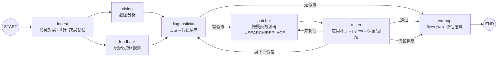

# 俄罗斯方块：在游玩的过程中 Debug

> **基于多模态证据的 Debug Agent 设计** —— 玩家只管玩游戏，Agent 负责把游戏修好。

在一个俄罗斯方块里注入 **12 个真实编码错误**。玩家自然游玩，游戏自动产出四路多模态证据（行为埋点 / 报错日志 / 文字反馈 / 截图）；LangGraph 多智能体流水线据此定位 bug、生成代码补丁、经受控测试验证后应用——**目标是 20 局内修完全部 12 个 bug**，收敛过程全程可评估。

## 核心闭环

```
玩家游玩 ──▶ 多模态证据采集 ──▶ Agent 诊断修复 ──▶ 测试验证 ──▶ 跨局记忆
   ▲            │ telemetry.jsonl      │ 假设清单          │ 通过=保留     │ fixes.json
   │            │ errors.log           │ 补丁生成          │ 失败=回滚     │ 累计修复
   └────────────┼ feedback_text.md     └───────────────────┴─────────────┴─▶ 20 局收敛 12/12
                └ screenshot_*.png
```

## Agent 流水线架构

LangGraph StateGraph，黑板模式共享状态；7 个节点，4 个 LLM 智能体 + 3 个纯代码节点：



- **ingest**：加载对局数据，运行 12 个纯代码探针（三态：signal / no_signal / no_evidence），读入 fixes.json 跨局记忆
- **vision / feedback**：截图 + 文字反馈/报错 → 结构化发现，与探针证据三路互补
- **diagnostician**：证据 × 现象目录 → 假设清单（现象号 + 嫌疑函数 + 置信度），LLM 产出经归一化校验，不合法直接丢弃
- **patcher**：只拿嫌疑函数源码生成 SEARCH/REPLACE 补丁；无嫌疑函数时注入全函数源码防碎片补丁
- **tester**：补丁应用到注入版游戏 → 跑受控测试集 → 通过保留、失败从备份回滚；路由控制「重试 ≤3 次 → 换假设 → 结账」
- **wrapup**：合并 fixes.json（fixed 累积 / rejected 带局号 / remaining / status）+ 写每局评估

## 目录结构

```
tetris-playanddebug/
├── tetris-game/            # 出题方侧：出题与评分（pipeline 永不可读）
│   ├── bugs.yaml           #   12 个 bug 的注入记录（代码级）
│   ├── tetris_v0.py        #   干净基线版
│   └── scripts/
│       ├── gen_catalog.py  #   bugs.yaml → 现象目录 + truth_map（含泄漏自检）
│       ├── record_gold.py  #   干净版 12 场景 headless 录制 → golden 快照
│       └── score_eval.py   #   离线评分：join truth_map → 收敛曲线
└── tetris-debug-agent/     # Agent 沙盒（pipeline 只能读写这里，路径 jail 强制）
    ├── game/               #   注入版游戏 + 行为埋点记录器
    ├── agent/              #   LangGraph 流水线（graph/state/nodes/tools）
    ├── tests/              #   受控测试集 test_B01-B12 + golden 等价回归
    ├── data/               #   catalog / fixes.json / 对局数据 runs/
    ├── eval/               #   每局评估 round_N.json + campaign.json
    ├── logs/               #   黑板流日志（每局一份）
    └── scripts/            #   play.py 玩家入口 / run_pipeline.py 流水线入口
```

## 关键设计

| 设计 | 解决什么问题 |
|---|---|
| **真实 bug，非模拟** | 12 个都是真实编码错误（如移动方向取反、暂停后恢复失效），用户试玩可验证，有对应红→绿测试 |
| **目录物理隔离** | 出题方与 Agent 沙盒分离 + 路径 jail；truth_map/注入记录绝不进任何 prompt，杜绝「看答案」 |
| **受控测试集** | Agent 自写测试不作为通过依据；每次只跑「已修复 bug ∪ 当前假设」的测试，修完的回归保持绿 |
| **golden 等价回归** | 用干净版录制 12 个单机制场景回放比对，防止「修 A 坏 B」；manifest 门控避免未收敛期永远红 |
| **补丁可回滚** | SEARCH 串必须恰好命中一次才应用（fail-fast），应用前备份，失败自动还原 |
| **跨局记忆** | fixes.json 累积修复/否决（带局号）；diagnostician 拿到「已修复勿提/已否决谨慎重提」，同一现象跨局可凭新证据重试 |
| **全链路可降级** | 无 API key 时走 MockLLM + 纯代码兜底假设，图完整可跑；OpenRouter 429/空响应自动退避重试 |
| **评估可量化** | 每局 tokens/图步/时长/假设命中率落盘；黑板流全程写日志；离线评分输出 ASCII 收敛曲线 |

## 快速开始

```bash
# 依赖（Python 3.10+；tkinter 为标准库）
pip install pyyaml pytest langgraph openai httpx pillow

cd tetris-debug-agent
cp .env.example .env.local        # 填入 OpenRouter API key（该文件已被 gitignore）
```

**1. 玩家游玩**（自动采集埋点/报错；异常可点游戏内「反馈」按钮提交文字与截图）：

```bash
python scripts/play.py --round 4 --seed 42   # 局号决定数据目录 data/runs/round_4
```

**2. 运行 Agent**（推荐每玩几局跑一次，已有评估的局自动跳过、可续跑）：

```bash
python scripts/run_pipeline.py --campaign --mode llm --verbose
python scripts/run_pipeline.py --round 5 --mode llm   # 也可单局运行
```

**3. 查看评估**（每局汇总 + ASCII 收敛曲线 + token 成本账）：

```bash
python ../tetris-game/scripts/score_eval.py --out data/eval_report.md
```

无 API key 时加 `--mode mock` 可零成本验证全图流转。

## 实测样例（OpenRouter 真实运行）

| 局 | 数据类型 | 假设 | 结果 | tokens(入/出) | 图步 |
|---|---|---|---:|---|---:|
| 1 | 381 事件 + 反馈 | 5 条全过校验 | **PH-05 一次修复**（测试 3 passed）；PH-01/02 三次尝试正确否决 | 17.6k/2.5k | 23 |
| 2 | clean 对照局 | 0 条 | **零误报**，不重提已修复/已否决现象 | 9.1k/0.1k | 6 |
| 3 | 暂停异常局 | 1 条（PH-09, conf 0.9） | 3 次补丁未过测试 → 正确否决并记录 | 12.7k/0.8k | 13 |

## 模型

- 视觉：`qwen/qwen3-vl-235b-a22b-instruct`（OpenRouter）
- 文本：`deepseek/deepseek-chat`（OpenRouter）
