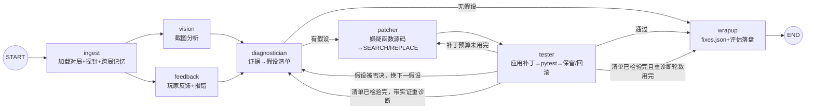

# 俄罗斯方块：在游玩的过程中 Debug

> **基于多模态证据的 Debug Agent 设计** —— 玩家只管玩游戏，Agent 负责把游戏修好。

在一个俄罗斯方块里注入 **12 个真实编码错误**。玩家自然游玩，游戏自动产出四路多模态证据（行为埋点 / 报错日志 / 文字反馈 / 截图）；LangGraph 多智能体流水线据此定位 bug、生成代码补丁、经受控测试验证后应用——**目标是 20 局内修完全部 12 个 bug**，收敛过程全程可评估。

## 核心闭环

```
玩家游玩 ──▶ 多模态证据采集 ──▶ Agent 诊断修复 ──▶ 测试验证 ──▶ 跨局记忆
   ▲            │ telemetry.jsonl      │ 假设清单          │ 通过=保留     │ fixes.json
   │            │ errors.log           │ 补丁生成          │ 失败=回滚     │ 累计修复
   └────────────┼ feedback_text.md     └───────────────────┴─────────────┴─▶ 20 局收敛 12/12
                └ screenshot_*.png
```

## Agent 流水线架构

LangGraph StateGraph，黑板模式共享状态；7 个节点，4 个 LLM 智能体 + 3 个纯代码节点：


```mermaid
flowchart LR
    S((START)) --> ingest[ingest\n加载对局+探针+跨局记忆]
    ingest --> V[vision\n截图分析] & F[feedback\n玩家反馈+报错]
    V --> D[diagnostician\n证据→假设清单]
    F --> D
    D -->|有假设| P[patcher\n嫌疑函数源码→SEARCH/REPLACE]
    D -->|无假设| W[wrapup\nfixes.json+评估落盘]
    P --> T[tester\n应用补丁→pytest→保留/回滚]
    T -->|通过| W
    T -->|补丁预算未用完| P
    T -->|假设被否决，换下一假设| D
    T -->|清单已检验完，带实证重诊断| D
    T -->|清单已检验完且重诊断轮数用完| W
    W --> E((END))
```

- **ingest**：加载对局数据，运行 12 个纯代码探针（三态：signal / no_signal / no_evidence），读入 fixes.json 跨局记忆
- **vision / feedback**：截图 + 文字反馈/报错 → 结构化发现，与探针证据三路互补
- **diagnostician**：三路证据 → 自然语言假设清单（问题描述 + 嫌疑函数 + 置信度），**agent 不知道 bug 清单**，LLM 产出经归一化校验，不合法直接丢弃；配有只读源码工具（读嫌疑函数源码 / 查探针统计明细 / 查原始事件流），函数归因基于读过的源码而非函数名猜测，怀疑探针误报时可查原始事件流核查；清单已检验完后可携带失败实证（已否决假设 + 改法教训 + 失败原因）重诊断一轮
- **patcher**：只拿嫌疑函数源码生成 SEARCH/REPLACE 补丁；无嫌疑函数时注入全函数源码防碎片补丁
- **tester**：补丁应用到注入版游戏 → 全量受控测试与基线对比归因（未修复 bug 的测试整文件转绿 = 归因修复）→ golden 等价回归 → 通过保留、失败从备份回滚并回传差异摘要；预算制路由——单假设补丁预算（3 次）+ 单局总预算（20 次），同一失败原因重复 3 次即提前放弃当前假设，假设清单已检验完后携带失败实证重诊断一轮
- **wrapup**：合并 fixes.json（fixed 累积 / rejected 带局号与改法教训 / remaining / status）+ 尝试历史落盘（patch_history.jsonl 审计账本 + runs/round_N/patches.md 可读版）+ 写每局评估

> 泄漏防御贯穿始终：现象目录（catalog）只含代码遗留备注式弱线索，且已不进任何 LLM prompt——diagnostician 只见三路证据归纳出的自然语言；PH-xx 编号与 truth_map 仅存在于框架内部（tester 归因 / 收敛判定 / 评分），绝不出现在假设、补丁与修复总结中。

## 12 个真实 Bug 清单

全部为真实编码错误形态（调试遗留 / 变量写错 / 逻辑缺失），有对应红→绿测试，玩家可亲自试玩验证：

| 编号 | 现象 |
|---|---|
| B01 | O 块下落速度异常，约为其他形状的 5 倍 |
| B02 | 旋转不检查碰撞，可旋转进已落定的方块或边界里 |
| B03 | 消除满行后分数不增加 |
| B04 | 方块堆满顶部、新块无处生成时游戏不结束，新块直接叠在已有方块上 |
| B05 | 按右方向键方块向左移动（与左键行为相同） |
| B06 | 游戏区 I 块显示为红色，与预览区的青色 I 块不一致 |
| B07 | 预览显示的总是当前下落的方块（滞后一拍），失去预告作用 |
| B08 | 两行以上同时填满时只消掉一行，其余满行残留 |
| B09 | 按 Esc 暂停后无法再恢复，暂停面板关不掉 |
| B10 | 按 ↓ 硬降时方块原地不动，无法快速落底 |
| B11 | 预览区多个方块轮廓叠加残影，越玩越花 |
| B12 | 一局结束再开新局，窗口位置回到左上角不保持 |

## 快速开始

```bash
# 依赖（Python 3.10+；tkinter 为标准库）
pip install pyyaml pytest langgraph openai httpx pillow

cd tetris-debug-agent
cp .env.example .env.local        # 填入 OpenRouter API key（该文件已被 gitignore）
```

**玩家游玩**（自动采集埋点/报错；异常可点游戏内「反馈」按钮提交文字与截图；关闭游戏窗口后自动启动 debug 并打印修复总结）：

```bash
python scripts/play.py   # 局号自动递增
```

**查看评估**（每局汇总 + ASCII 收敛曲线 + token 成本账；或生成自包含 HTML 报告）：

```bash
python ../tetris-game/scripts/score_eval.py --out data/eval_report.md
python ../tetris-game/scripts/gen_html_report.py    # → eval_reports/report.html
```

**终止实验**（未收敛中途结束也可用）——归档本次全部运行数据并把游戏回退到原始 12-bug 版，作为 agent 迭代平行对比的干净起点：

```bash
python scripts/archive_reset.py            # 默认归档当前实验
python scripts/archive_reset.py --tag 实验名 --yes   # 指定标签并免确认
```

## 游戏结束后DeBug示例
- 

## 模型

- 视觉：`qwen/qwen3-vl-235b-a22b-instruct`（OpenRouter）
- 文本：`deepseek/deepseek-chat`（OpenRouter）
