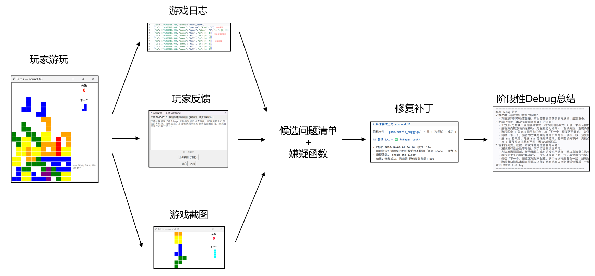
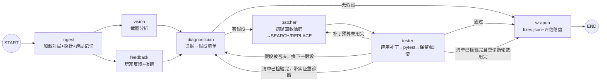

# 俄罗斯方块：在游玩的过程中 Debug

> **基于多模态证据的 Debug Agent 设计** —— 伴随玩家每轮的游玩过程，Agent收集行为埋点/玩家反馈/玩家截图数据，识别并自主优化游戏的真实问题。

## 执行流程



## Agent 流水线架构

LangGraph StateGraph，黑板模式共享状态；7 个节点，4 个 LLM 智能体 + 3 个纯代码节点：


```mermaid
flowchart LR
    S((START)) --> ingest[ingest\n加载对局+探针+跨局记忆]
    ingest --> V[vision\n截图分析] & F[feedback\n玩家反馈+报错]
    V --> D[diagnostician\n证据→假设清单]
    F --> D
    D -->|有假设| P[patcher\n嫌疑函数源码→SEARCH/REPLACE]
    D -->|无假设| W[wrapup\nfixes.json+评估落盘]
    P --> T[tester\n应用补丁→pytest→保留/回滚]
    T -->|通过| W
    T -->|补丁预算未用完| P
    T -->|假设被否决，换下一假设| D
    T -->|清单已检验完，带实证重诊断| D
    T -->|清单已检验完且重诊断轮数用完| W
    W --> E((END))
```

- **ingest**：加载对局数据，通过埋点探针收集游戏数据
- **vision / feedback**：将玩家截图/玩家反馈文字整理成结构化证据
- **diagnostician**：分析多模态证据形成症状假设清单
- **patcher**：基于diagnostician反馈的假设生成 SEARCH/REPLACE 补丁
- **tester**：将补丁应用至游戏中检验修复是否生效、是否引起新的问题；如果对症状假设的修复没有解决问题，推送diagnostician节点重新生成症状清单
- **wrapup**：将本轮debug的历史记录持久化

## 12 个真实 Bug 清单

全部为真实编码错误形态（调试遗留 / 变量写错 / 逻辑缺失），有对应红→绿测试，玩家可亲自试玩验证：

| 编号 | 现象 |
|---|---|
| B01 | O 块下落速度异常，约为其他形状的 5 倍 |
| B02 | 旋转不检查碰撞，可旋转进已落定的方块或边界里 |
| B03 | 消除满行后分数不增加 |
| B04 | 方块堆满顶部、新块无处生成时游戏不结束，新块直接叠在已有方块上 |
| B05 | 按右方向键方块向左移动（与左键行为相同） |
| B06 | 游戏区 I 块显示为红色，与预览区的青色 I 块不一致 |
| B07 | 预览显示的总是当前下落的方块（滞后一拍），失去预告作用 |
| B08 | 两行以上同时填满时只消掉一行，其余满行残留 |
| B09 | 按 Esc 暂停后无法再恢复，暂停面板关不掉 |
| B10 | 按 ↓ 硬降时方块原地不动，无法快速落底 |
| B11 | 预览区多个方块轮廓叠加残影 |
| B12 | 游戏窗口位置默认在左上角，玩家手动调整后新一局依然刷新在左上角，影响游戏体验 |

## 快速开始

```bash
# 依赖（Python 3.10+；tkinter 为标准库）
pip install pyyaml pytest langgraph openai httpx pillow

cd tetris-debug-agent
cp .env.example .env.local        # 填入 OpenRouter API key
```

**玩家游玩**（自动采集埋点/报错；异常可点游戏内「反馈」按钮提交文字与截图；关闭游戏窗口后自动启动 debug 并打印修复总结）：

```bash
python scripts/play.py   # 局号自动递增
```

**查看评估**（每局汇总 + ASCII 收敛曲线 + token 成本）：

```bash
python ../tetris-game/scripts/score_eval.py --out data/eval_report.md
python ../tetris-game/scripts/gen_html_report.py    # → eval_reports/report.html
```

**终止实验**（未收敛中途结束也可用）——归档本次全部运行数据并把游戏回退到原始版本，作为 agent 迭代平行对比的干净起点：

```bash
python scripts/archive_reset.py            # 默认归档当前实验
python scripts/archive_reset.py --tag 实验名 --yes   # 指定标签并免确认
```

## 模型

- 视觉：`qwen/qwen3.8-27b`（OpenRouter）
- 文本：`deepseek/deepseek-v4.1-flash`（OpenRouter）
